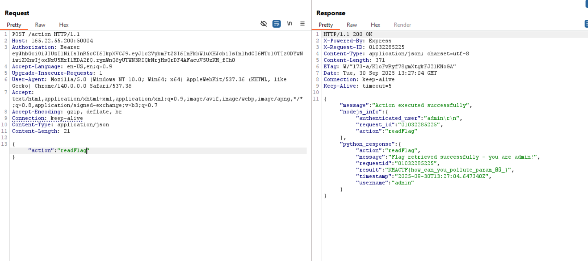

- Để ý, ```index.js``` xử lý ```/register``` tài khoản chỉ bằng yêu cầu đăng nhập nhiều hơn **5 kí tự**, và kiểm tra nó có phải chuỗi không (Không chuẩn hóa và loại bỏ các control charector).

--> Chuỗi ```"admin\r\n"``` là chuỗi hợp lệ (length > 5) 

--> Server chấp nhận và lưu nguyên xi.

- Node tin tưởng JWT mà không **validate** lại role của user và sự tồn tại của nó.

```js
const authenticateToken = (req, res, next) => {
    const authHeader = req.headers['authorization'];
    const token = authHeader && authHeader.split(' ')[1];
    if (!token) {
        return res.status(401).json({ error: 'Access token required' });
    }
    jwt.verify(token, JWT_SECRET, (err, user) => {
        if (err) {
            return res.status(403).json({ error: 'Invalid or expired token' });
        }
        req.user = user;
        next();
    });
};
```

- Node tạo và verify JWT, rồi ```authenticateToken``` chỉ ```jwt.verify(token, JWT_SECRET)``` sau đó gán ```req.user = user``` luôn.
    
--> Thiếu kiểm tra ```users[req.user.username]``` tồn tại, không check role (***isAdmin***) từ db.
    
--> Các token chỉ cần hợp lệ (**đăng kí thành công**) là đều pass.
    
- Vấn đề ở đây: Ở ```nodejs-server``` không normalize khi lưu username. Còn ```Python-server``` thì có 

```js
username = request.form.get('username', '').strip()
```

--> Có thể đăng kí username chứa kí tự ***nonvisible*** (Không thấy) sau đó tới Python thì được loại bỏ kí tự đó.

--> Thành admin.

- Đầu tiên: gửi request đăng kí username với name: "admin\r\n" 
  
- Lấy token từ tài khoản vừa đăng kí để đọc flag.


