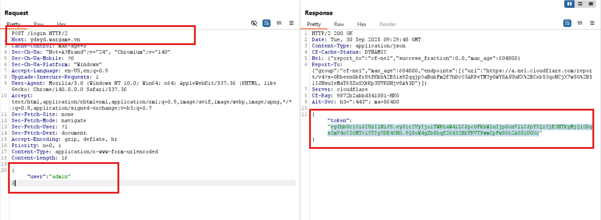
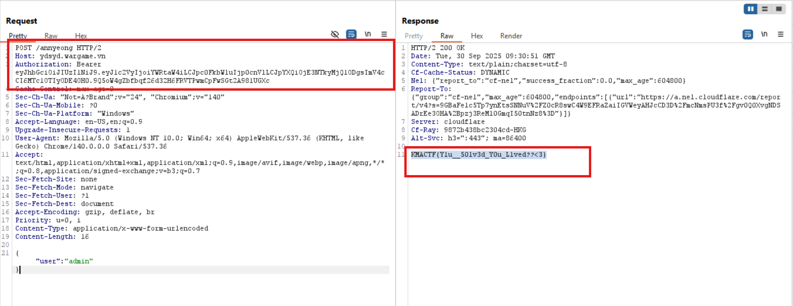

># Phân tích luồng hoạt động:

- Khởi tạo dữ liệu: 
    ○ Flag được gán chuỗi ```"KMACTF{hehe}"```

    ○ Users gồm 3 tài khoản: ```alice```, ```bob```, ```admin``` với ```"isAdmin: false/true"``` tương ứng.
    
    ○ "JWT_SECRET" là 1 chuỗi cố định ```"<It's a secret, but I trust you'll figure it out>"```

    --> Được mã hóa thành secretKey.
    
```js
const JWT_SECRET = "<It's a secret, but I trust you'll figure it out>";
const secretKey = new TextEncoder().encode(JWT_SECRET);
const flag = "KMACTF{hehe}";
```
        
- ```/login``` (POST):

```js
if (url.pathname === "/login" && request.method === "POST") {
            try {
                const body = await request.json();
                const user = body.user;
                if (!user || !users[user]) {
                    return new Response("User not found", { status: 404 });
                }
                const token = await generateToken(user, users[user].isAdmin);
                return new Response(JSON.stringify({ token }), {
                    status: 200,
                    headers: { "Content-Type": "application/json" },
                });
            } catch {
                return new Response("Invalid JSON", { status: 400 });
            }
        }
```


○ Body json có dạng: ```{"user":"<username>"}```

○ Server không yêu cầu nhập password, chỉ check xem nó có tồn tại không.

○ Nếu tồn tại, server gọi ```"generateToken(user, users[user].isAdmin)"``` --> Trả token HS256 chứa ```{user, isAdmin}```
    
- Xác thực (authenticate):

```js
async function authenticate(request: Request) {
    const authHeader = request.headers.get("authorization");
    if (!authHeader || !authHeader.startsWith("Bearer ")) return null;
    const token = authHeader.slice(7);
    try {
        const { payload } = await jwtVerify(token, secretKey, {
            algorithms: ["HS256"],
        });
        if (payload && typeof payload.user === "string" && users[payload.user]) {
            return { username: payload.user as string, isAdmin: payload.isAdmin === true };
        }
    } catch { }
    return null;
}

const auth = await authenticate(request);
if (!auth) return new Response("Unauthorized. Use POST /login then POST /annyeong with Bearer token", { status: 401 });

        ○ Lấy token từ header authorization: Bearer <token>
        ○ jwtVerify(token, secretKey, { algorithms: ["HS256"] }) để xác thực chữ ký.
        ○ Nếu chữ ký hợp lệ và payload có user tồn tại trong "users", trả về:
    
    { username: payload.user as string, isAdmin: payload.isAdmin === true }
```    
    
- ```/annyeong``` (POST):

```js
function merge(target: any, source: any) {
    for (const key in source) {
        if (key === "template" || key === "user") continue;
        if (
            source[key] &&
            typeof source[key] === "object" &&
            target[key] &&
            typeof target[key] === "object"
        ) {
            merge(target[key], source[key]);
        } else {
            target[key] = source[key];
        }
    }
    return target;
}


const userInfo = users[username];
        if (!Object.getPrototypeOf(userInfo.config)) {
            Object.setPrototypeOf(userInfo.config, userInfo.configProto);
            if (!userInfo.config.user) userInfo.config.user = { name: username };
        }

if (url.pathname === "/annyeong" && request.method === "POST") {
            try {
                const data = await request.json();
                merge(userInfo.configProto, data);
                if (isAdmin) {
                    return new Response(flagGetter(), { status: 200 });
                }
                const template = "{{name}} says hello";
                const result = sandboxTemplate(template, userInfo.config.user);
                return new Response(result, { status: 200 });
            } catch {
                return new Response("Invalid JSON or sandbox error", { status: 400 });
            }
        }
```

○ Sau authenticate, lấy ```userInfo = users[username]```

○ Nếu ```userInfo.config``` chưa có ```prototype```, ```Object.setPrototypeOf(userInfo.config, userInfo.configProto)``` và đảm bảo ```"userInfo.config.user"``` tồn tại.

○ Sau đó ```merge(userInfo.configProto, data)``` với "data" là JSON attacker gửi.

○ **Quan trọng**: nếu ```"isAdmin === true"``` (từ authenticate), server ```return new Response(flagGetter(), 200}``` -- Trả về flag. Nếu không thì thực hiện templating an toàn và trả về chuỗi  ```"{{name}} says hello"```
    
- ```Template sandbox```: 

```js
const safeProps = new Set(["name", "user"]);

function sandboxTemplate(template: string, context: any) {
    const proxy = new Proxy(context, {
        get(target, prop) {
            if (safeProps.has(prop as string)) {
                return Reflect.get(target, prop);
            }
            throw new Error("Access denied to property: " + prop.toString());
        },
    });
    return template.replace(/\{\{(\w+)\}\}/g, (_, key) => {
        try {
            const val = (proxy as any)[key];
            if (typeof val === "string" || typeof val === "number") return val;
        } catch { }
        return "";
    });
}
```

○  ```sanboxTemplate(template, context)``` tạo Proxy(context) chỉ cho phép đọc các thuộc tính trong ```safeProps = new Set(["name", "user"])```.

○ ```Replace()``` chỉ cho phép đọc key là kí tự ```chữ/số/underscrore``` (word chars). 

--> Template injection bị hạn chế.
    

- Workflow giải bài:

Đầu tiên, cơ chế lấy flag của bài là ở endpoint ```"/annyeong"``` sẽ dựa trên biến ```"isAdmin"``` để quyết định leak flag ra.

```js
if (isAdmin) {
    return new Response(flagGetter(), { status: 200 });
}
```

Mà biến ```"isAdmin"``` liên quan tới hàm ```authenticate(request)```:

```js
async function authenticate(request: Request) {
    const authHeader = request.headers.get("authorization");
    if (!authHeader || !authHeader.startsWith("Bearer ")) return null;
    const token = authHeader.slice(7);
    try {
        const { payload } = await jwtVerify(token, secretKey, {
            algorithms: ["HS256"],
        });
        if (payload && typeof payload.user === "string" && users[payload.user]) {
            return { username: payload.user as string, isAdmin: payload.isAdmin === true };
        }
    } catch { }
    return null;
}
```

Hàm này lấy giá trị của header ```"authorization"```, nếu header không tồn tại hoặc không bắt đầu bằng ```"Bearer ..."``` trả về null 

Tiếp theo tách token cắt bỏ ```"Bearer "``` để lấy phần JWT

Xác thực chữ ký JWT theo HS256 dùng secretKey.

Kiểm tra payload và trả về object có isAdmin === true.

# **Các bước làm**

- Bước 1: Gửi request Post /login với json: {"user":"admin"} để lấy token admin



- Bước 2: Gửi tới ```/annyeong``` kèm header ```Authorization: Bearer <token>``` 




