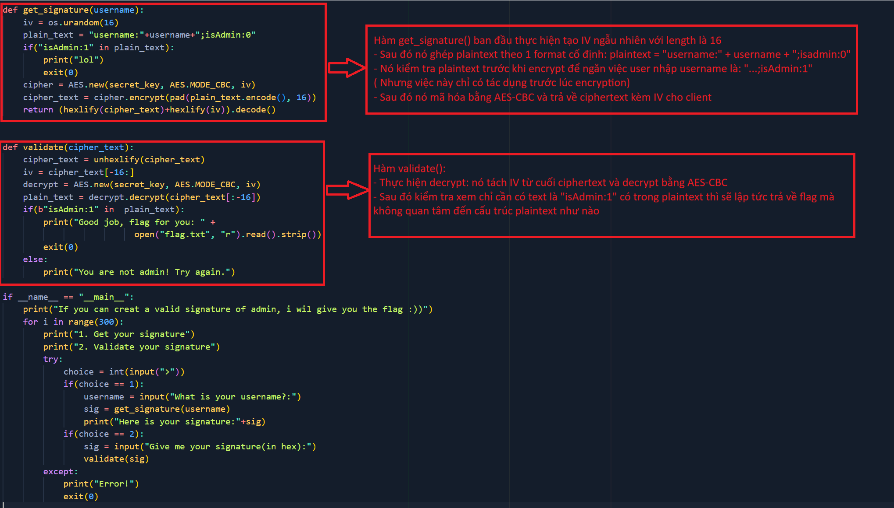
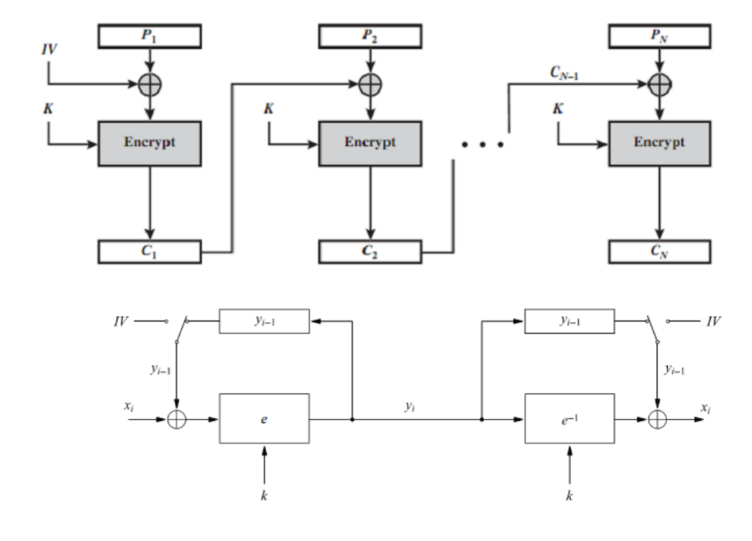
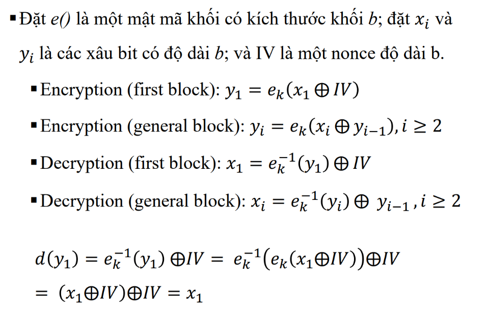
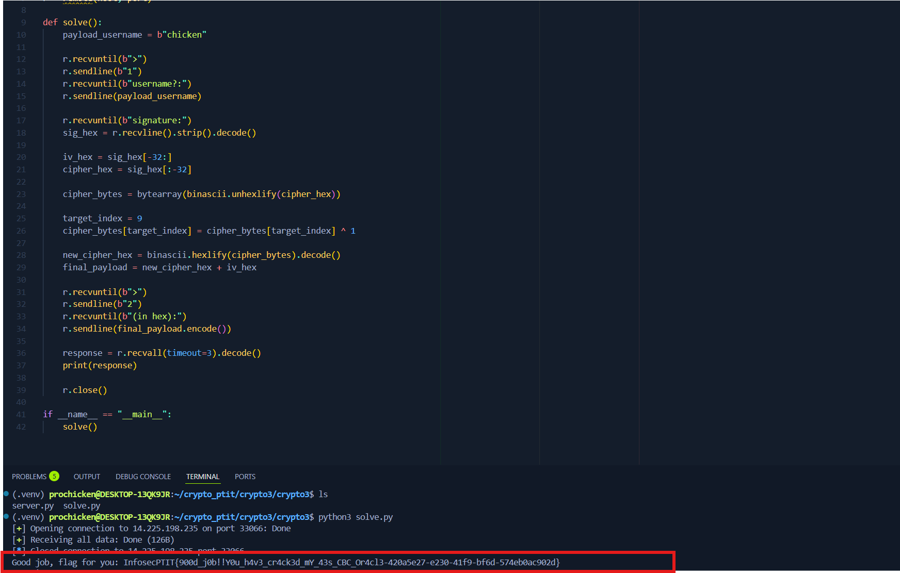
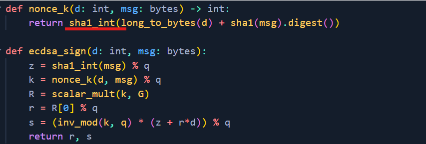
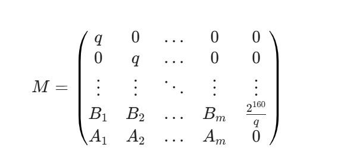
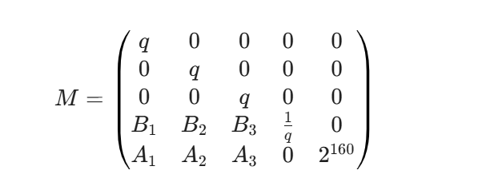
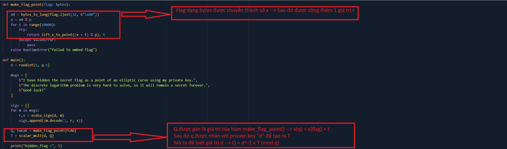
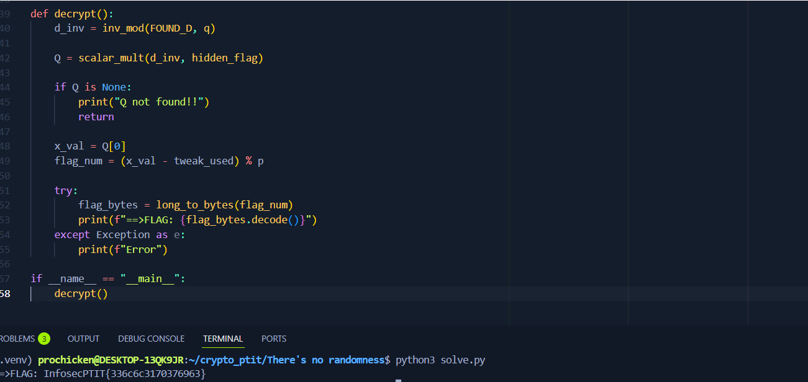

# Are u admin?
- Phân tích ```server.py```:



- Theo source của đề bài thì ta có thể suy đoán được bài này thuộc dạng CBC-bit flipping attack

- Sơ qua về CBC mode:





- Ở CBC mode có đặc điểm đó là các blocks không đứng độc lập nhau. Khối đằng sau sẽ phụ thuộc vào khối trước đó
  
--> Nếu tạo ra Plaintext của khối thứ 2, server sẽ giải mã khối Ciphertext thứ 2, sau đó lấy kết quả XOR với khối Ciphertext thứ 1

- Mà trong phép toán XOR, khi ta đổi 1 bit đầu vào của phép XOR, kết quả output sẽ thay đổi chính xác tại bit đó

--> Áp dụng vào bài: Mục tiêu của ta là biến chuỗi ```isAdmin:0``` thành ```isAdmin:1```. 

- Ta cần nhập chuỗi username để block 1 sẽ chỉ bao gồm: "username:...." nằm ở block đầu tiên, còn "isAdmin:0" nằm trong block 1, để ta có thể sửa đổi Ciphertext của block 0 nhằm ảnh hưởng đến block 1 (cụ thể là giá trị '0')

    ○ Cụ thể cấu trúc plaintext của ta là: "username:" (9 bytes) + INPUT + ";isAdmin:0"

    ○ Ta muốn "isAdmin:0" ở block 1 thì ta cần cho INPUT là 16 - 9 = 7 bytes 

--> Username cần là *chicken* (7 bytes)

--> Khi đó plaintext sẽ là:

- Block 0: ```username:chicken``` (16bytes)

- Block 1: ```";isAdmin:0"``` + padding

- Tiếp theo ta xác định vị trí của 0 trong block 1 để nhằm thực hiện sửa đổi với block 0 (nó ở index 9)

    ○ Ta sẽ đổi '0' thành '1' và phép toán cần thực hiện trên byte 9 của Block 0 bằng cách ta sẽ lấy chuỗi Hex mà server trả về sau đó ở byte thứ 9 XOR với 1 rồi send lại cho server.




# There's no randomness

- Ta cần khôi phục lại flag được giấu trong "hidden_flag" bằng cách tìm ra private-key "d" từ các chữ ký ECDSA được cung cấp
    
- Quá trình ký, đoạn mã lại sử dụng "SHA-1" để tạo số ngẫu nhiên k (nonce)




- Đường cong P-256 có bậc của nhóm q = 2256

--> k <= 2^160  . Mà 1 nonce an toàn trong EDCSA phải là 1 số ngẫu nhiên đồng nhất trong khoảng *[1, q - 1]*

--> Ta có thể sử dụng Lattice attack để khôi phục private-key d

- Ta có phương trình tạo chữ ký ECDSA là:

```s = k-1(z + r.d) (mod q)```

-->
 
```k = s-1z + s-1r.d (mod q)```

Mà ta có 3 cặp giá trị *(r, s)* từ file *output.txt* (hoặc output khi chạy ```chall.py```)

--> Ta có thể xây dựng 1 hệ phương trình và giải bằng thuật toán LLL (**Lenstra-Lenstra-Lovasz**) với dạng như sau:



Ta có 3 msg nên ta có được m = 3. Ta có ma trận L kích thước (m+2)x(m+2) như sau:



- Khi chạy thuật toán LLL trên ma trận, vector ngắn nhất là d mà ta cần tìm (Ở đây ta sử dụng *sagemath* để thuận tiện dùng thuật toán LLL)


```python
import hashlib
q = 0xffffffff00000000ffffffffffffffffbce6faada7179e84f3b9cac2fc632551 
sigs = [
  {
    'msg': 'I have hidden the secret flag as a point of an elliptic curve using my private key.',
    'r': 0x5d44ec301e20a96d8453bbb9556e2d033b76f952a038f88bfb8af7862d0f6f83,
    's': 0x320cba43e1a8463d6d61860c2293d6128ed67c86c1985cc458c79f34a2ad77c1,
  },
  {
    'msg': 'The discrete logarithm problem is very hard to solve, so it will remain a secret forever.',
    'r': 0x266925d7a1ca275fc115baf88c7b4a806cbd9e1728d5e1be5b3b972f338648b3,
    's': 0xe1fc124f1bca4881a21ac12f57af791bafbef0bc01a1adccf460abd4b784fc01,
  },
  {
    'msg': 'Good luck!',
    'r': 0xd258894721504e5e538e8b1c9b0c5e802e969bee6370303438fac3eb44bb8483,
    's': 0xf873fd91867a186cd6b3288087aca469fb805c03ea416c399f84bd11723f9e14,
  }
]
def solve_hnp_d(sigs):
    m = len(sigs)
    K_BOUND = 2^160
    
    M = Matrix(QQ, m + 2, m + 2)
    
    for i in range(m):
        msg_bytes = sigs[i]['msg'].encode()
        z = int(hashlib.sha1(msg_bytes).hexdigest(), 16)
        r = sigs[i]['r']
        s = sigs[i]['s']
        
        s_inv = pow(s, -1, q)
        
        A = (s_inv * z) % q
        B = (s_inv * r) % q
        
        M[i, i] = q       
        M[m, i] = B      
        M[m+1, i] = A    
    M[m, m] = 1/q          
    M[m+1, m+1] = K_BOUND 
    
    reduced_M = M.LLL()
    
    for row in reduced_M:
        potential_d = abs(row[m]) * q
        potential_d = int(potential_d)
        
        if potential_d == 0: continue
            
        z0 = int(hashlib.sha1(sigs[0]['msg'].encode()).hexdigest(), 16)
        r0 = sigs[0]['r']
        s0 = sigs[0]['s']
        k_check = (pow(s0, -1, q) * (z0 + r0 * potential_d)) % q
        
        if k_check < 2**160:
            return potential_d
            
    return None
d = solve_hnp_d(sigs)
print(f"{d}")
```

Ta tìm được d có giá trị: 

```13507059083800494186035050605610466411138525977036431739791066456794637672089```




- Sau khi có d, ta tính ngược lại điểm Q, mà ta có 

***xQ = xflag + t*** --> ***xflag = xQ - t***

Ta nhận được flag:



