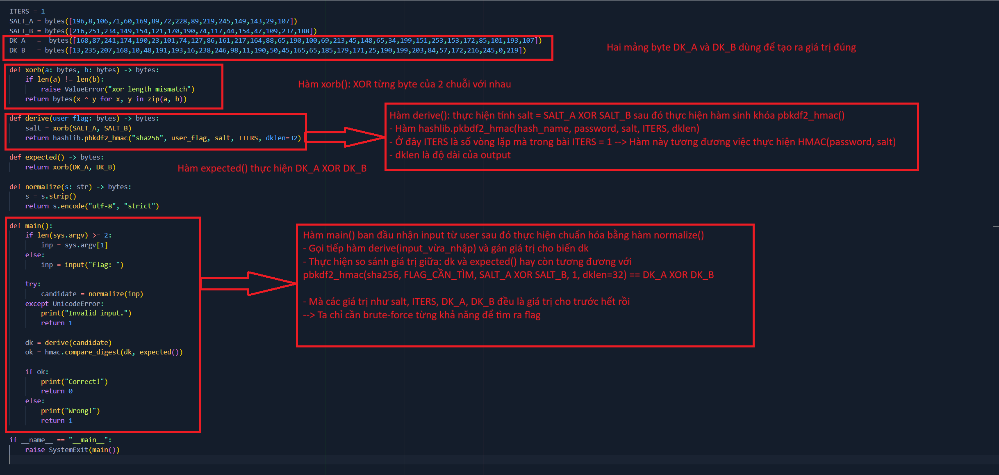
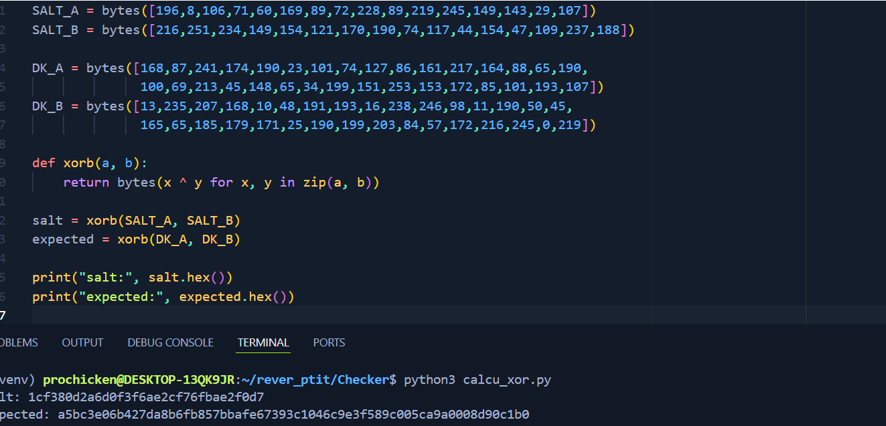
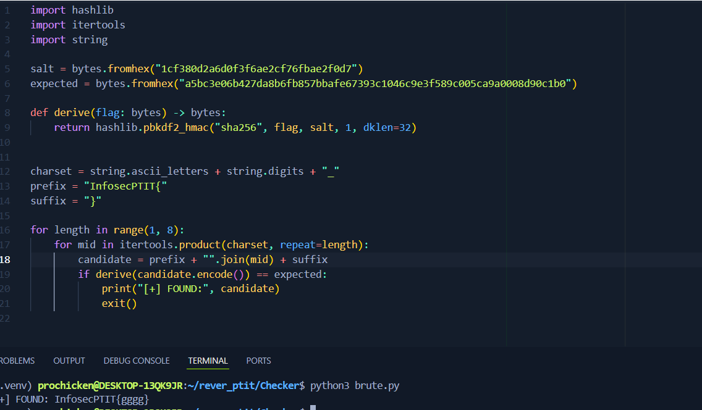

# Checker

- Phân tích ```checker.py```:
    ○ Là 1 file check xem flag có đúng hay không, nếu nhập đúng thì in ra **Correct**, sau thì **Error**



- Đầu tiên ta thực hiện tính *salt* và *expected* trước:



- Sau đó ta thực hiện brute-force giá trị của flag:



